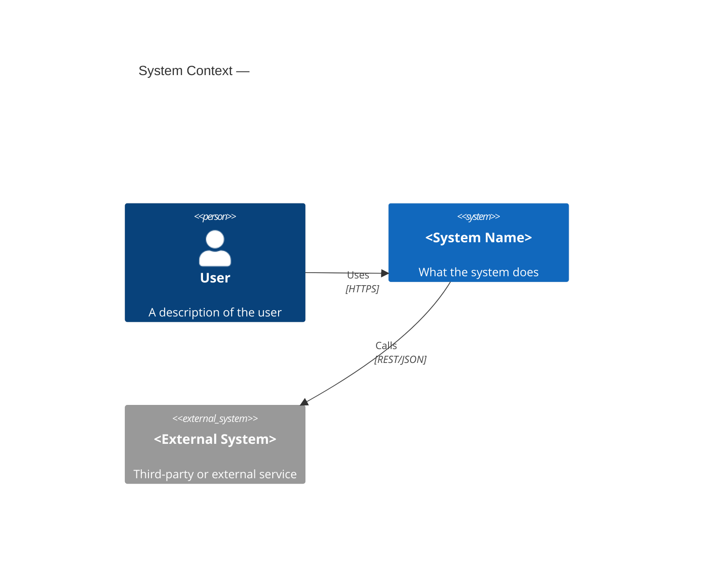
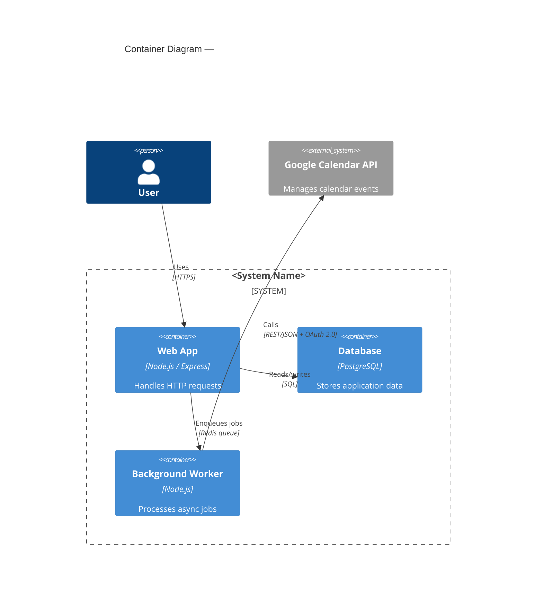
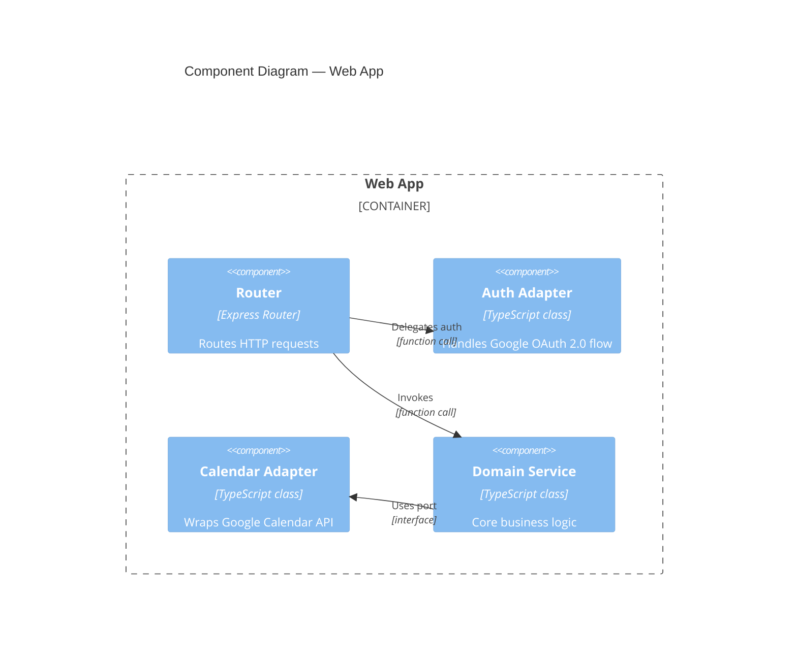
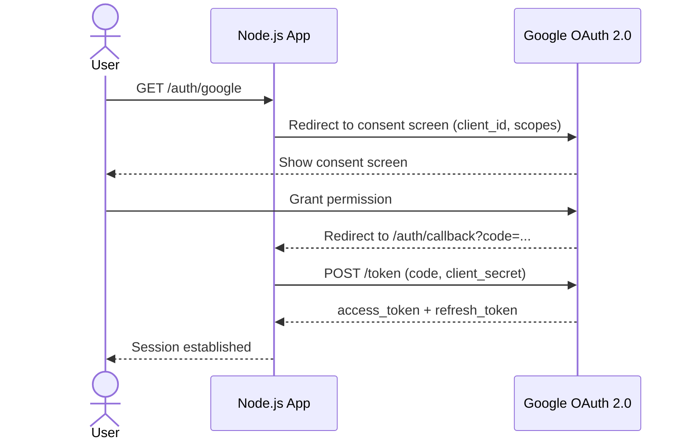
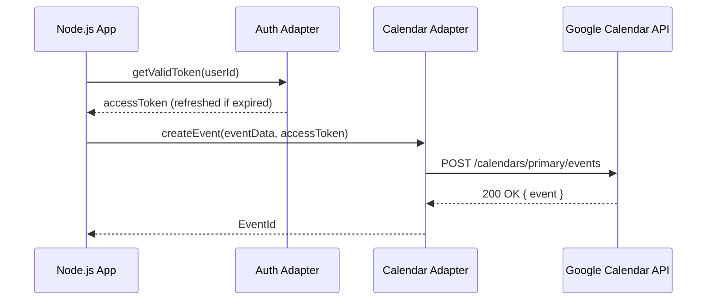

# Mermaid C4 Diagram Patterns

Copy-paste starting points for the most common diagram types.

---

## C4 Context Diagram

---

## C4 Container Diagram

---

## C4 Component Diagram

---

## Sequence Diagram — OAuth 2.0 Flow

---

## Sequence Diagram — Calendar API Integration

---

## Tips

- Keep each diagram to **one level of zoom** — don't mix C4 levels.
- Label every arrow with **what** is exchanged and **how** (protocol/format).
- Use `System_Ext` for anything you don't own or deploy.
- For complex flows, prefer sequence diagrams over component diagrams.