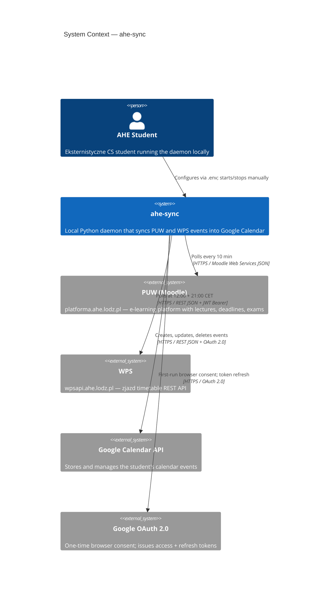
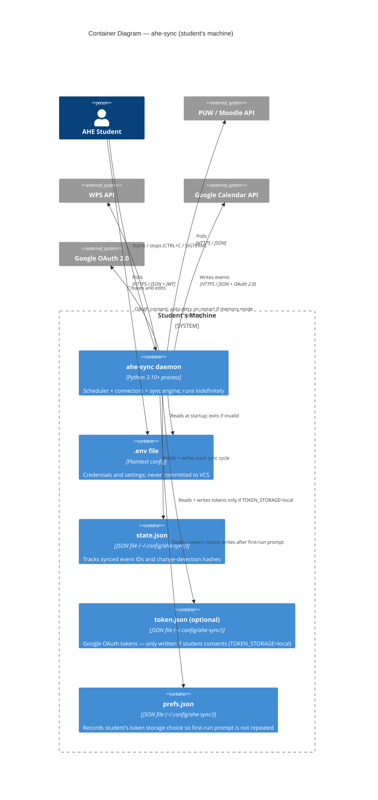
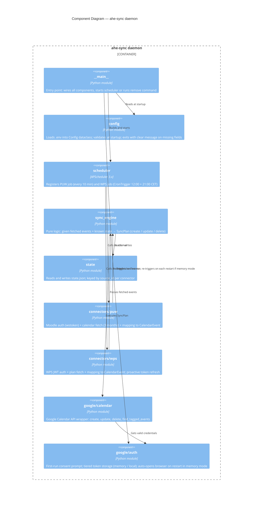

# Architecture: ahe-sync

**Status:** v1.0 — Architect iteration, ready for team review
**Date:** 2026-03-29
**Architect:** Claude (AI-assisted)

---

## 1. C4 Level 1 — System Context



---

## 2. C4 Level 2 — Containers



---

## 3. C4 Level 3 — Daemon Components



---

## 4. Key Sequence Flows

### 4.1 First-run OAuth Consent (with storage consent prompt)

```mermaid
sequenceDiagram
  actor Student
  participant Main as __main__
  participant Auth as google/auth
  participant Browser
  participant Google as Google OAuth 2.0

  Student->>Main: python -m ahe_sync (start daemon)
  Main->>Auth: get_valid_credentials()
  Auth-->>Auth: No token in memory; check TOKEN_STORAGE in .env
  alt TOKEN_STORAGE not set and prefs.json absent
    Auth->>Student: Prompt — [1] store locally (default) or [2] memory only?
    Student-->>Auth: Choice (Enter = local)
    Auth-->>Auth: Write prefs.json (choice recorded; prompt not repeated)
  end
  Auth->>Browser: Auto-open OAuth consent URL
  Browser->>Google: Student grants permission
  Google-->>Auth: Redirect localhost:PORT/callback → auth code
  Auth->>Google: POST /token (code + client_secret)
  Google-->>Auth: access_token + refresh_token
  alt TOKEN_STORAGE=local (default)
    Auth-->>Auth: Write token.json (chmod 600) to ~/.config/ahe-sync/
  else TOKEN_STORAGE=memory (opt-in)
    Auth-->>Auth: Hold token in process memory only
  end
  Auth-->>Main: credentials (in-memory object)
  Main->>Main: Start scheduler
```

### 4.2 Normal PUW Sync Cycle

```mermaid
sequenceDiagram
  participant Scheduler
  participant PUW as connectors/puw
  participant Engine as sync_engine
  participant State as state
  participant GCal as google/calendar

  Scheduler->>PUW: run_sync()
  PUW->>PUW: POST /login/token.php → wstoken (if expired)
  PUW->>PUW: POST core_calendar_get_calendar_monthly_view (×3 months)
  PUW-->>Engine: List[CalendarEvent]
  Engine->>State: load("puw")
  State-->>Engine: known_state {source_id → {gcal_id, timemodified}}
  Engine-->>Engine: compute_diff() → SyncPlan{to_create, to_update, to_delete}
  Engine->>GCal: create/update/delete per event (per-event; partial failures retried next cycle)
  Engine->>State: save("puw", updated_state)
  Engine-->>Scheduler: log SyncResult (created, updated, deleted counts)
```

---

## 5. Project Structure

```
ahe_sync/
├── __main__.py         # Entry point: wires components, handles `ahe-sync remove` subcommand
├── config.py           # .env → Config dataclass (pydantic or dataclasses + manual validation)
├── models.py           # Shared dataclasses: CalendarEvent, SyncState, SyncPlan, SyncResult
├── state.py            # StateStore: read/write ~/.config/ahe-sync/state.json
├── scheduler.py        # APScheduler setup; register PUW (IntervalTrigger) + WPS (CronTrigger)
├── sync_engine.py      # compute_diff() + apply_sync_plan(); pure functions; no I/O
├── google/
│   ├── auth.py         # get_valid_credentials(); first-run browser flow; token.json
│   └── calendar.py     # CalendarClient: create_event, update_event, delete_event, find_tagged_events
└── connectors/
    ├── base.py         # ConnectorBase ABC: fetch() → list[CalendarEvent]
    ├── puw.py          # Moodle: wstoken auth + 3-month calendar fetch + mapping
    └── wps.py          # WPS: JWT auth (with proactive refresh) + plan fetch + mapping

tests/
├── unit/
│   ├── test_sync_engine.py   # compute_diff and apply logic; no external deps needed
│   ├── test_puw_mapper.py    # Fixture JSON → CalendarEvent mapping correctness
│   └── test_wps_mapper.py    # Fixture JSON → CalendarEvent mapping correctness
└── integration/
    └── test_calendar_client.py  # Against mocked google-api-python-client

scripts/
└── setup.py            # Cross-platform setup: creates .venv, installs deps, copies .env.example → .env
pyproject.toml          # Declares dependencies; no console_scripts entry (no PyPI publishing)
.env.example            # All keys with descriptions; safe to commit
requirements.txt        # Pinned lockfile for reproducible installs
```

**Wiring principle:** `__main__.py` is the only place that instantiates components and passes them to each other. No global state, no hidden singletons.

---

## 6. Core Data Models

```python
# models.py

@dataclass
class CalendarEvent:
    source: Literal["puw", "wps"]
    source_id: str           # str(MoodleCalendarEvent.id) or str(IDPlanZajecPoz)
    title: str
    description: str
    start: datetime          # timezone-aware (Europe/Warsaw)
    end: datetime            # timezone-aware
    all_day: bool            # True for PUW "due" events
    timemodified: int | None # PUW: epoch seconds; used for update detection
    checksum: str | None     # WPS: MD5 of mutable fields (time, room, teacher)

@dataclass
class SyncPlan:
    to_create: list[CalendarEvent]
    to_update: list[tuple[CalendarEvent, str]]  # (event, gcal_event_id)
    to_delete: list[str]                         # gcal_event_ids

@dataclass
class SyncResult:
    source: Literal["puw", "wps"]
    created: int
    updated: int
    deleted: int
    errors: list[str]   # human-readable; non-fatal failures → retry next cycle
```

**State JSON shape** (`~/.config/ahe-sync/state.json`):
```json
{
  "puw": {
    "1001": { "gcal_event_id": "abc123xyz", "timemodified": 1712345678 }
  },
  "wps": {
    "9876": { "gcal_event_id": "def456uvw", "checksum": "a1b2c3d4" }
  }
}
```

---

## 7. Google Calendar Tagging

Every event written by this tool carries two extended properties:

| Key | Value | Purpose |
|-----|-------|---------|
| `ahe-sync-source` | `"puw"` or `"wps"` | Identifies origin; enables `remove --source` |
| `ahe-sync-id` | e.g. `"1001"` | Stable source ID for deduplication and bulk lookup |

Extended properties are set in `privateProperties` (not shared with guests). `find_tagged_events()` uses the `privateExtendedProperty=ahe-sync-source=puw` query param to list only tool-managed events.

**Safety invariant:** `delete_event()` and `update_event()` in `google/calendar.py` only accept `gcal_event_id` values that were sourced from state.json — they do not query events by title or time range.

---

## 8. Resolved Architecture Decisions

Open questions from PRD §7 resolved below. Full rationale in `docs/adr/`.

| PRD Item | Decision | ADR |
|----------|----------|-----|
| Python packaging | Clone repo + `python scripts/setup.py`; no PyPI (security: no public artifact risk) | ADR-0001 |
| Scheduler library | APScheduler 3.x (`IntervalTrigger` for PUW; `CronTrigger` for WPS) | ADR-0002 |
| Token storage | Tiered: `memory` (default) / `local` (opt-in); student consent prompt on first run | ADR-0003 |
| State storage | `~/.config/ahe-sync/state.json` unconditionally (no credentials; no consent required) | ADR-0003 |
| Project structure | Flat modules + thin connector layer; no full hexagonal | ADR-0004 |
| WPS semester dates | Derived from first/last event `DataOD`/`DataDO` in live API response; `.env` override available | Inline below |
| WPS JWT refresh | Proactive: re-authenticate when `exp - now < 5 minutes` | Inline below |
| `timeduration: 0` (PUW) | Create as 0-duration event (Google Calendar renders as a point reminder) | Inline below |
| `attendance` events (PUW) | **Skip in v1.** Not mapped; not synced. | Inline below |
| Partial sync failure | Per-event tracking: update state only for succeeded events; failures retried next cycle | Inline below |
| Network failure | Skip current cycle; log error with suggested action; no retry within the same cycle | Inline below |
| `.env` missing at startup | Hard exit with explicit list of missing required keys; no partial startup | Inline below |

---

## 9. `.env` Schema

```dotenv
# Required — PUW connector (omit entirely to disable)
PUW_USERNAME=
PUW_PASSWORD=

# Required — WPS connector (omit entirely to disable)
WPS_USERNAME=
WPS_PASSWORD=

# Required — Google OAuth (Path A: shared team app)
GOOGLE_CLIENT_ID=         # Published in repository
GOOGLE_CLIENT_SECRET=     # Never committed; distributed separately

# Optional — token storage (prompted on first run if not set; Enter accepts default)
TOKEN_STORAGE=                        # local (default) | memory
                                      # local:  token persisted to ~/.config/ahe-sync/token.json (chmod 600)
                                      # memory: token in process memory only; browser re-auth on restart

# Optional — overrides (defaults shown)
PUW_POLL_INTERVAL_MINUTES=10          # Minimum enforced: 10
WPS_POLL_TIMES_CET=12:00,21:00        # Comma-separated HH:MM
GOOGLE_CALENDAR_ID=primary

# Optional — per-event reminders (minutes before; 0 = no reminder)
REMINDER_LECTURE_MINUTES=30
REMINDER_DEADLINE_MINUTES=1440        # 24h
REMINDER_EXAM_MINUTES=60
REMINDER_WPS_MINUTES=60

# Optional — WPS semester date override (auto-detected from API by default)
WPS_SEMESTER_FROM=                    # ISO date: YYYY-MM-DD
WPS_SEMESTER_TO=                      # ISO date: YYYY-MM-DD
```

---

## 10. Log Format

```
[2026-04-01 12:00:01 CET] [PUW] ✓ 2 created, 0 updated, 1 deleted
[2026-04-01 12:00:01 CET] [WPS] ✓ 0 created, 3 updated, 0 deleted
[2026-04-01 12:00:02 CET] [PUW] ✗ AuthError: wstoken rejected — check PUW_USERNAME / PUW_PASSWORD in .env
[2026-04-01 12:00:02 CET] [DAEMON] Started. PUW: every 10 min | WPS: 12:00, 21:00 CET
[2026-04-01 14:37:55 CET] [DAEMON] Stopped.
```

---

## 11. What Is Intentionally Not in This Architecture

- No HTTP server or framework (this is a pure daemon — no web interface in v1)
- No database (state.json is sufficient for the sync volume)
- No full hexagonal architecture (two connectors, one output — flat modules are more readable)
- No dependency injection framework (explicit wiring in `__main__.py` is clearer at this scale)
- No retry queue (failures are retried naturally on the next scheduled cycle)
